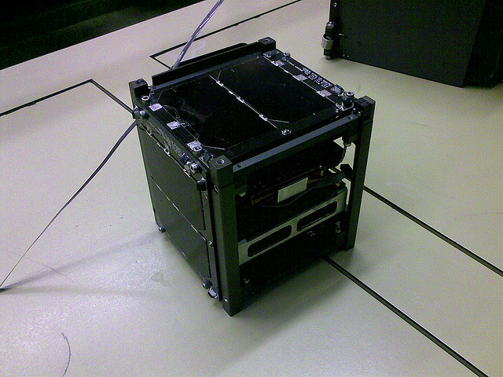
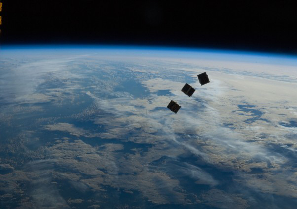
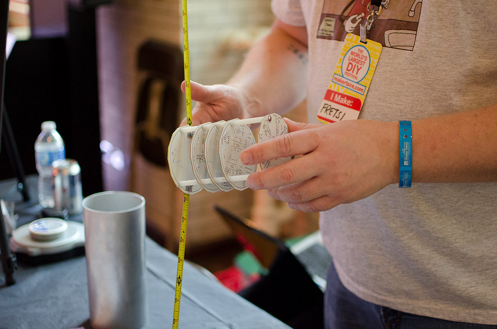
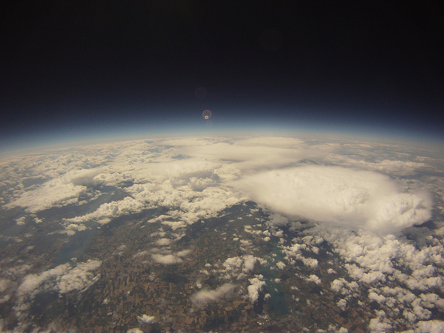
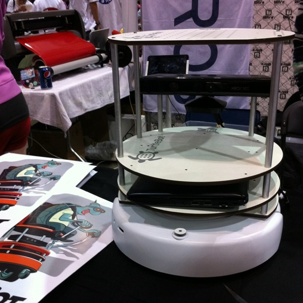
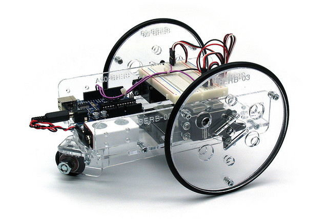
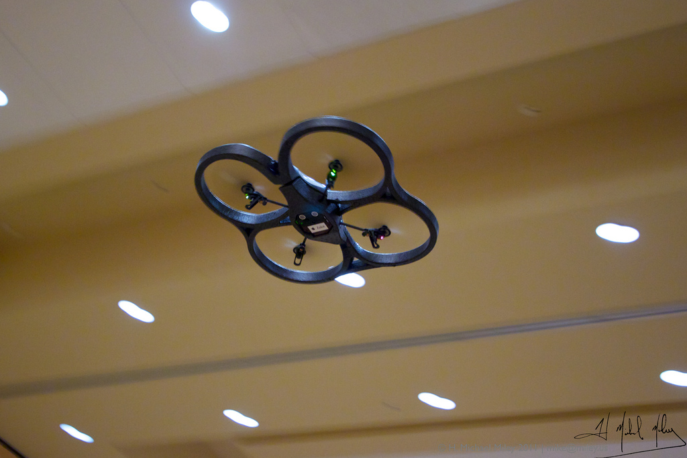
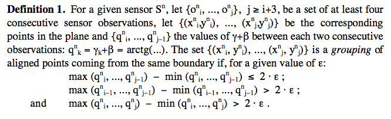
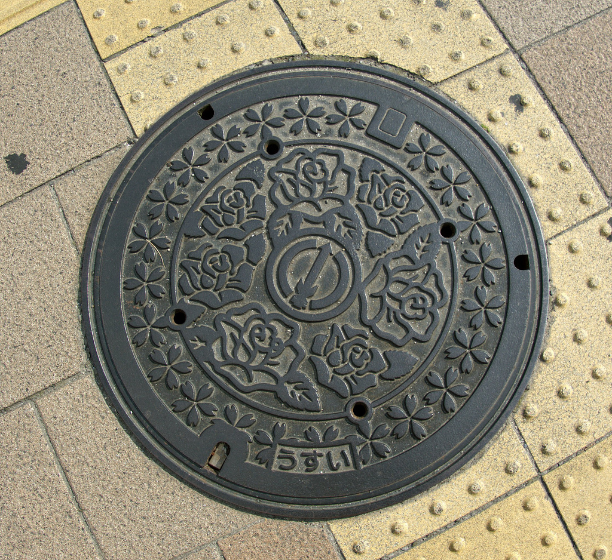

# &ldquo;Sysadmining Python to the Moon&rdquo;

   

## Fred Alger

    @_phred  fred@fredalger.net

.fx: title

---
# "Sysadmining?"
---
# ROBOTS n' STUFF
---
# import antigravity
---

.fx: imageslide

---
# &ldquo;Space in yo face&rdquo;
---
# How do Geeks get to Space?
---
# How do Geeks get to Space?
* How YOU can get to space
* How Python can get you there

---
# whoami
---
# whoami

    !ini
    [fred]

---
# whoami

    !ini
	  [fred]
	  
      occupation = dad

      loves = space
	  
	  notes = failed to become astronaut.

---

# anyone else?

---
## Image Credit: [nasahqphoto on Flickr](http://www.flickr.com/photos/nasahqphoto/8089420632/)

.fx: imageslide whiteheading

---

# how to get to space?

---

# how to get to space
## be awesome and dedicated

---

# how to get to space
## $$$$$$$$$

---

# how to get to space
## make cool stuff!

---

>The programmer&hellip; works only slightly removed from pure thought-stuff…

---

> Yet the program construct is real in the sense that it moves and works&hellip; separate from the construct itself.

&mdash; Fred Brooks

---
# this is how we get to space!
---
# what do we need?
---
# what do we need?
* a way to run code
* in space

---
# Still lots left to explore!
---
# Best time?
---
# Best time is now
* Cheap hardware
* Fast hardware
* Free software
* Priz€ Mone¥

---
# cubesat
## photo credit: [waiferx on flickr](http://www.flickr.com/photos/waiferx/3422446706/sizes/z/in/photostream/)

.fx: imageslide whiteheading

---
# cubesat: $40k

.fx: imageslide whiteheading

---
# cubesat
* Runs code?
* In space?

---
# cubesat
* In space? YEP
* Runs code? OH YEAH

---
# cubesat

* photography
* experiments
* communication

---
# cubesat
* Sputnik

---
# tubesat: $8k
## photo credit: [badastronomy on flickr](http://www.flickr.com/photos/badastronomy/8060557043/)

.fx: imageslide whiteheading

---
# tubesat
* Runs code
* In space.
* w00t.

---
# cheaper?

---
# weather balloon: < $1k
## photo credit: [k2gxt on flickr](http://www.flickr.com/photos/62621941@N02/5699593877/)

.fx: imageslide whiteheading

---
# weather balloon
* Camera
* Phone
* Embedded system

---
# weather balloon
* Runs code
* "near space"
* CLOSE ENOUGH.

---
# Old & Busted
* Money: $$$$$$$$$$$$$$$$$$$$$$$$$$$$...
* People: ||||||||||||||||||||||||||||||||||||||||||||||||||||||||...
---
# Old & Busted
* Money: $$$$$$$$$$$$$$$$$$$$$$$$$$$$...
* People: ||||||||||||||||||||||||||||||||||||||||||||||||||||||||...
* Hardware: proprietary
* Software: custom

---
# Old & Busted
* Money: $$$$$$$$$$$$$$$$$$$$$$$$$$$$...
* People: ||||||||||||||||||||||||||||||||||||||||||||||||||||||||...
* Hardware: proprietary
* Software: custom
* Time: years
* Run By: The Government™

---
# New hotness
* Money: $$$
* People: |||

---
# New hotness
* Money: $$$
* People: |||
* Hardware: commodity
* Software: open source / custom

---
# New hotness
* Money: $$$
* People: |||
* Hardware: commodity
* Software: open source / custom
* Time: months (to years)
* Run By: Private

---
# robots
---
# how I'm getting to space
---
# turtlebot: < $1k
## Photo credit: [jinghuaz on flickr](http://www.flickr.com/photos/jinghuaz/5748608360/)

.fx: imageslide whiteheading

---
# kits: < $100
## Photo credit: [snazzyguy on Flickr](http://www.flickr.com/photos/snazzyguy/3139984471/)

.fx: imageslide whiteheading

---
# robots
* Run code
* Maybe in space?

---
#    spacepride.org

.fx: imageslide whiteheading

---
#    small team, private

.fx: imageslide whiteheading

---
# NASA Centennial Challenge
---
# NASA Centennial Challenge
* Lots of challenges
* Robots that drive themselves

---
# NASA Centennial Challenge
* Robots that drive... ON THE MOON

---
# good robots go to space!!!
---
# how to make a *good* robot?
---

.fx: imageslide

---
# robots == PCs
---
# robots
* Linux boxes
* With wheels

---
# ... or rotors :)
## Photo credit: [mike_miley on Flickr](http://www.flickr.com/photos/mike_miley/6028030648/)

.fx: imageslide whiteheading

---
# Linux
* Robot OS or ROS

---
# willowgarage.com
## Photo credit: [jinghuaz on flickr](http://www.flickr.com/photos/jinghuaz/5748608360/)

.fx: imageslide whiteheading

---
# ROS
* Ubuntu

---
# ROS
* Ubuntu
* Package system

---
# ROS
* Ubuntu
* Package system (2k+ packages)

---
# ROS
* Ubuntu
* Package system
* Messages

---
# ROS
* Ubuntu
* Package system
* Messages
* Full Python support

---
# Robots are hard

---
# Robots are hard
* Basic comprehension

---
# Robots are hard
* Math

---
# Robots are hard
* Hard math -> There's already code out there

---
# Robots are hard
* Seeing: OpenCV

---
# Robots are hard
* OpenCV
* Planning/Coordination: ROS

---
# Robots are hard
* OpenCV
* ROS
* Mapping: PointCloud

---
# Robots are hard
* OpenCV              &rarr; Python
* ROS                 &rarr; Python
* PointCloud          &rarr; Python

---
# Robots are hard
* "Live" bugs

---
# Robots are hard
* "Live" bugs -> Live debugging!

---
# Twisted "manholes"

## Photo credit: [jannem on Flickr](http://www.flickr.com/photos/jannem/580945748/)

.fx: imageslide whiteheading

---
# Robots+python = fun
---
# How do we get to space?

---
# How do we get into space?
* BUILD COOL STUFF

---
# fin.

.fx: imageslide whiteheading

---

